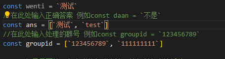

# Qxml-Yunzai-Bot JS合集

---

## 目录

[自动处理进群事件](https://github.com/Dnyo666/Qxml-Yunzai-js#自动处理进群事件V2.7.js)

### 自动处理进群事件V2.7.js

#### 安装

```
curl -o "./plugins/example/自动处理进群事件v2.7.js" "https://github.com/Dnyo666/Qxml-Yunzai-js/blob/main/自动处理进群事件v2.7.js"
```

#### 简介

用于多个群管理多个答案自动判断进群

#### 效果图

  <br>
    
    

---


## 致谢
| Nickname                                                     | Contribution                        |
| :----------------------------------------------------------: | ----------------------------------- |
|[飞舞]() | 负责了进群事件js的修改 |
|[浅巷墨黎](https://github.com/dnyo666) | 主要负责人 |
|[一只哒]() | 提供了js意见 |
|[千奈千祁](https://gitee.com/qiannqq/yunzai-plugin-JS) | 进群时间js的源代码作者 |
--- 

# 关于我

| | |
| :----------------------------------------------------------: | ----------------------------------- |
| 交流群QQ： | [303104111](http://qm.qq.com/cgi-bin/qm/qr?_wv=1027&k=q_jnwK0Fvmt41oGM6G67R4mm7evxxt-3&authKey=0PJdkDi7kf6KLmq5Jty3LMEgvPIJIxBrZp6beSQWWHRSkca%2FvclKT1geLnr3Okjm&noverify=0&group_code=303104111)|
| Gitee | [浅巷墨黎](https://gitee.com/Dnyo666) |
| | |
