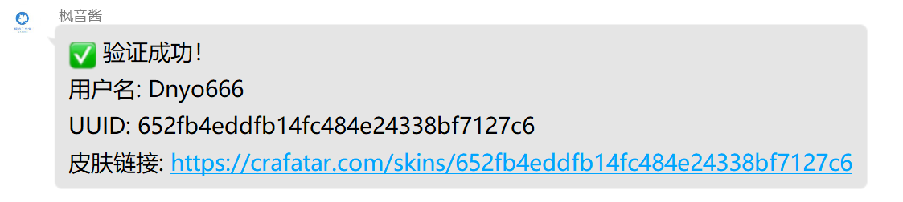

# Qxml-Yunzai-Bot JS合集

---

## 目录

[自动处理进群事件V2.9](https://github.com/Dnyo666/Qxml-Yunzai-js?tab=readme-ov-file#%E8%87%AA%E5%8A%A8%E5%A4%84%E7%90%86%E8%BF%9B%E7%BE%A4%E4%BA%8B%E4%BB%B6v29js)

[mc服务器列表V2.4.js](https://github.com/Dnyo666/Qxml-Yunzai-js?tab=readme-ov-file#mc%E6%9C%8D%E5%8A%A1%E5%99%A8%E5%88%97%E8%A1%A8v24js)

[mc正版用户名验证进群](https://github.com/Dnyo666/Qxml-Yunzai-js?tab=readme-ov-file#mc正版用户名验证进群.js)

[KimiV2.2.js](https://github.com/Dnyo666/Qxml-Yunzai-js?tab=readme-ov-file#kimiv22js)

[glmV7.2.js](https://github.com/Dnyo666/Qxml-Yunzai-js?tab=readme-ov-file#glmv72js)

[百词斩V3.2.js](https://github.com/Dnyo666/Qxml-Yunzai-js?tab=readme-ov-file#%E7%99%BE%E8%AF%8D%E6%96%A9v32js)

### #自动处理进群事件V2.9.js

#### 安装

##### Github

```
curl -o "./plugins/example/自动处理进群事件v2.9.js" "https://raw.githubusercontent.com/Dnyo666/Qxml-Yunzai-js/main/js/自动处理进群事件v2.9.js"
```
##### Gitee
```
curl -o "./plugins/example/自动处理进群事件v2.9.js" "https://gitee.com/Dnyo666/Qxml-Yunzai-js/raw/main/js/自动处理进群事件v2.9.js"
```

#### 简介

用于多个群管理多个答案自动判断进群，以及是否开启等级限制

#### 效果图

  <br>
    
    

### #mc服务器列表V2.4.js

#### 安装

##### Github

```
curl -o "./plugins/example/mc服务器列表V2.4.js" "https://raw.githubusercontent.com/Dnyo666/Qxml-Yunzai-js/main/js/mc服务器列表V2.4.js"
```
##### Gitee
```
curl -o "./plugins/example/mc服务器列表V2.4.js" "https://gitee.com/Dnyo666/Qxml-Yunzai-js/raw/main/js/mc服务器列表V2.4.js"
```

#### 简介&使用

在一个群里面添加多个Minecraft服务器地址，并可以通过#mclist列出他们的在线情况及ID描述

发送#mcadd [名称] [地址:端口] [描述] 即可添加服务器，发送#mclist即可列出服务器在线状态（大于五条时，将会进行转发）

发送#mcdel [ID] 即可删除服务器

发送#mcol 即可查询当前群聊服务器在线玩家名

#### 效果图

  <br>
    


### #mc正版用户名验证进群.js

#### 安装

##### Github

```
curl -o "./plugins/example/mc正版用户名验证进群.js" "https://raw.githubusercontent.com/Dnyo666/Qxml-Yunzai-js/main/js/mc正版用户名验证进群.js"
```
##### Gitee
```
curl -o "./plugins/example/mc正版用户名验证进群.js" "https://gitee.com/Dnyo666/Qxml-Yunzai-js/raw/main/js/mc正版用户名验证进群.js"
```

#### 简介

可多群使用（如需多群分开配置，可复制一份，注意修改数据目录），通过用户填写答案自动判断是否为正版用户名，并通过或待定，可配置重复用户名是拒绝还是待定

#### 效果图

  <br>
    

### #KimiV2.2.js

#### 安装

##### Github

```
curl -o "./plugins/example/KimiV2.2.js" "https://raw.githubusercontent.com/Dnyo666/Qxml-Yunzai-js/main/js/KimiV2.2.js"
```
##### Gitee
```
curl -o "./plugins/example/KimiV2.2.js" "https://gitee.com/Dnyo666/Qxml-Yunzai-js/raw/main/js/KimiV2.2.js"
```

#### 简介&使用

发送#kimi[对话内容]即可进行（有记忆），发送#结束kimi对话将结束本次长对话-需自行替换文件中的sk

#### 效果图

  <br>
    

### #glmV7.2.js

#### 安装

##### Github

```
curl -o "./plugins/example/glmV7.2.js" "https://raw.githubusercontent.com/Dnyo666/Qxml-Yunzai-js/main/js/glmV7.2.js"
```
##### Gitee
```
curl -o "./plugins/example/glmV7.2.js" "https://gitee.com/Dnyo666/Qxml-Yunzai-js/raw/main/js/glmV7.2.js"
```

#### 简介&使用

发送#glm[对话内容]即可进行（有记忆），发送#结束glm对话将结束本次长对话-需自行替换文件中的API Key（悄悄说一下，glm模型可以联网）

#### 效果图

  <br>
    
    

### #百词斩V3.2.js

#### 安装

##### Github

```
curl -o "./plugins/example/百词斩V3.2.js" "https://raw.githubusercontent.com/Dnyo666/Qxml-Yunzai-js/main/js/百词斩V3.2.js"
```
##### Gitee
```
curl -o "./plugins/example/百词斩V3.2.js" "https://gitee.com/Dnyo666/Qxml-Yunzai-js/raw/main/js/百词斩V3.2.js"
```

#### 简介&使用

发送#查词[单词]即可查询单词，同时获取朗读音频，命令有：#查词、#百词斩、#bcz

#### 效果图

  <br>
    

---


## 致谢
| Nickname                                                     | Contribution                        |
| :----------------------------------------------------------: | ----------------------------------- |
|[浅巷墨黎](https://github.com/dnyo666) | 百词斩、glm、Kimi、mc服务器列表-插件作者 |
|[飞舞](https://github.com/Catrong) | 自动处理进群事件v2.7.js-插件修改 |
|[一只哒]() | 提供了自动处理进群事件v2.7.js意见 |
|[千奈千祁](https://gitee.com/qiannqq/yunzai-plugin-JS) | 自动处理进群事件v2.7.js、kimi、glm（来源于他的通义千问）的源代码作者 |
--- 

# 关于我

| | |
| :----------------------------------------------------------: | ----------------------------------- |
| 交流群QQ： | [303104111](http://qm.qq.com/cgi-bin/qm/qr?_wv=1027&k=q_jnwK0Fvmt41oGM6G67R4mm7evxxt-3&authKey=0PJdkDi7kf6KLmq5Jty3LMEgvPIJIxBrZp6beSQWWHRSkca%2FvclKT1geLnr3Okjm&noverify=0&group_code=303104111)|
| Gitee | [浅巷墨黎](https://gitee.com/Dnyo666) |
| | |
